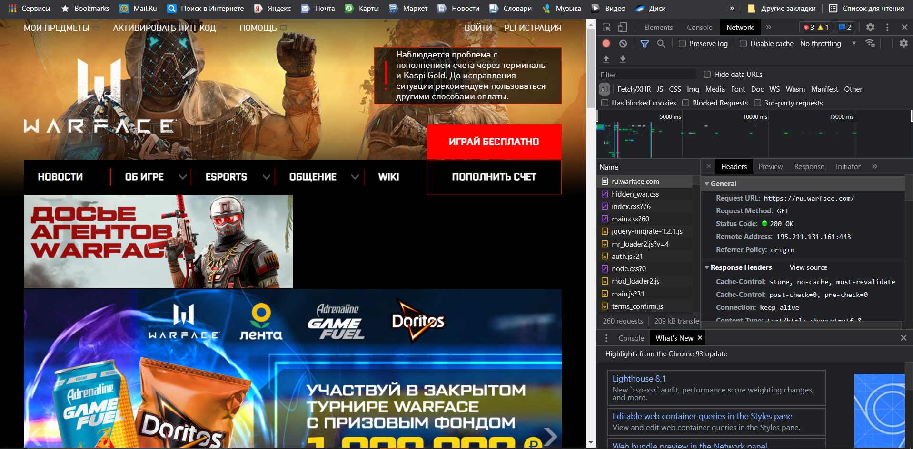
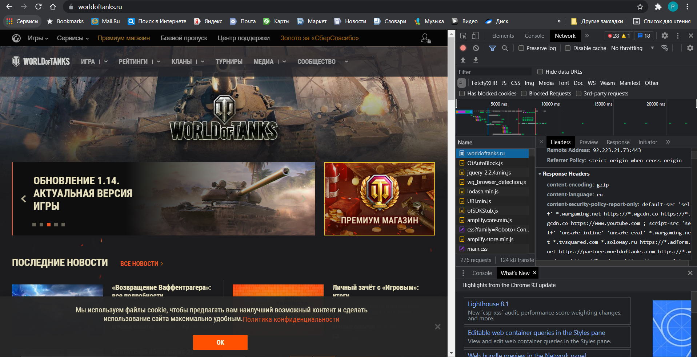

#Headers-of-Request-Response
**Постановка задачи:**   
написать эссе, отражающее особенности как минимум 10 уникальных HTTP-заголовков для Request и Response.
**Цель задания:**
 Получить необходимые практические навыки работы с HTTP протоколом.
##Эссе
Для начала решил проанализировать заголовки на сайте моей любимой игры https://ru.warface.com/

При переходе на сайт моей любимой игры, мы отправляем следующий запрос:
**Request Headers**
```css
Request URL: https://ru.warface.com/
Request Method: GET
Accept: text/html,application/xhtml+xml,application/xml;q=0.9,image/avif,image/webp,image/apng,*/*;q=0.8,application/signed-exchange;v=b3;q=0.9
Accept-Encoding: gzip, deflate, br
Accept-Language: ru-RU,ru;q=0.9,en-US;q=0.8,en;q=0.7
Cache-Control: max-age=0
Connection: keep-alive
Cookie: n_js_t=1632788272; n_js_d=2281644032; has_js=1; _gcl_au=1.1.444182169.1632788275; tmr_lvid=1d8e76cdbd08785bbffad34f6d2d5946; tmr_lvidTS=1632788274923; _gid=GA1.2.1941133212.1632788275; _ym_uid=1632788275978451699; _ym_d=1632788275; _ym_visorc=w; _ym_isad=1; PHPSESSID=itruafr67pbi4lnn43ofp0jup1; mrreferer=https://www.google.com/; mrcurrentpath=/; mr1lad=61525f3c2773b9ce-300_824-300_824-; __atuvc=2%7C39; __atuvs=61525f323a838115001; __atssc=google%3B2; _ga_LF5DZQ3NEX=GS1.1.1632788274.1.1.1632788426.59; _ga=GA1.2.1944176619.1632788275; _dc_gtm_UA-3127420-21=1; tmr_detect=1%7C1632788426751; tmr_reqNum=9
Host: ru.warface.com
Referer: https://www.google.com/
sec-ch-ua: "Google Chrome";v="93", " Not;A Brand";v="99", "Chromium";v="93"
sec-ch-ua-mobile: ?0
sec-ch-ua-platform: "Windows"
Sec-Fetch-Dest: document
Sec-Fetch-Mode: navigate
Sec-Fetch-Site: cross-site
Sec-Fetch-User: ?1
Upgrade-Insecure-Requests: 1
User-Agent: Mozilla/5.0 (Windows NT 10.0; Win64; x64) AppleWebKit/537.36 (KHTML, like Gecko) Chrome/93.0.4577.82 Safari/537.36
```
Теперь рассмотрим что означают некоторые заголовки:
- Заголовок **Accept** - в запросе задает типы данных, допустимые в ответе. Если сервер не может возвратить в ответе указанный тип содержимого, то возвращается код состояния HTTP 406 Not Acceptable.
- Заголовок **Accept-Encoding** - в запросе задает кодировки содержимого, допустимые в ответе. Если значение не указано, то в ответном сообщении по умолчанию применяется кодировка  identity (нет кодировки). 
- Заголовок **Accept-Language** - в запросе задает языки, допустимые в ответе. Например, "Accept-Language: ru-RU,ru,en-US" указывает, что предпочитается русский язык, но также допустим английский. 
- Заголовок **Connection** - указывает, что клиент хотел бы сохранить соединение активным. Постоянное соединение используется по умолчанию для запросов HTTP/1.1. 
- Заголовок **Cache-Control** - определяет количество времени и способ htaccess кэширования файла. 
###Response Headers  
Теперь переидем на сайт игры, в которую мы играем всей группой по вечерам https://worldoftanks.ru/ 

**Response Headers**
````css
Cache-Control: store, no-cache, must-revalidate
Cache-Control: post-check=0, pre-check=0
Connection: keep-alive
Content-Type: text/html; charset=utf-8
Date: Tue, 28 Sep 2021 00:20:41 GMT
Expires: Sun, 19 Nov 1978 05:00:00 GMT
Keep-Alive: timeout=120
Referrer-Policy: no-referrer-when-downgrade
Server: nginx
Strict-Transport-Security: max-age=31536000
Transfer-Encoding: chunked
X-Cached: HIT
X-Content-Type-Options: nosniff
X-Filter-Time: 0.209 ms
X-Frame-Options: SAMEORIGIN
X-Res-Usage-Time: U=88000,S=8000,R=489436
X-XSS-Protection: 1; mode=block; report=https://csreport.cdn.gmru.net/xss
````
Рассмотрим некоторые заголовки, которые интересны для меня: 
- Заголовок **Date** - содержит дату и время, в которое сообщение было создано.
- Заголовок **Referrer-Policy** - настраивает уровень детализации для включения в заголовок Referer при уходе со страницы. Помогает предотвратить утечку данных на сайты, куда идут ссылки.
- Заголовок **Expires** - значение этого заголовка говорит о том, начиная с какой даты и времени документ можно считать просроченным
- Заголовок **Content-Type** -  сообщает клиенту, какой будет тип передаваемого контента. В некоторых случаях браузеры пытаются сами определить MIME тип передаваемого контента.
- Заголовок **Strict-Transport-Security** - заголовок ответа (часто используется аббревиатура HSTS (en-US)), позволяющий web-сайтам уведомить браузер о том, что доступ к ним должен быть осуществлён только посредством HTTPS вместо HTTP.

##Вывод
Мы получили практический опыт работы с HTPP протоколом. Теперь мы можем дружно идти в наши любимые игры

